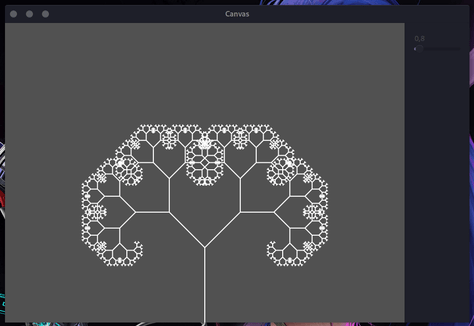
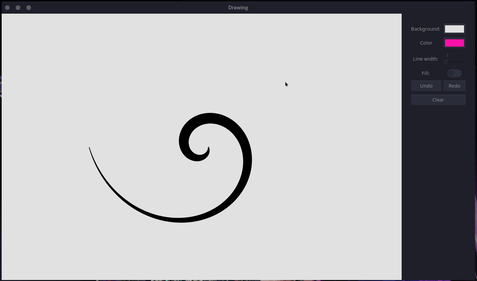
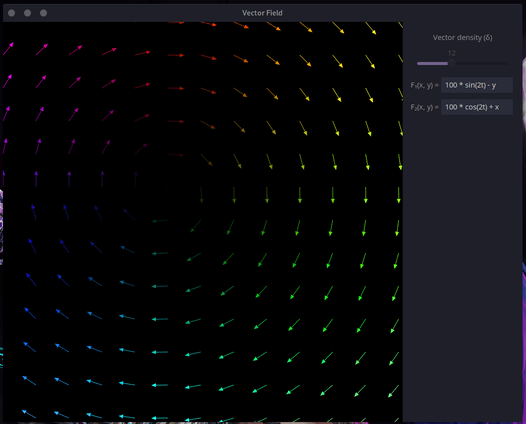

# Alexya.jl

[](https://github.com/jorge-brito/Alexya.jl/actions?query=workflow%3ACI)
[](https://juliahub.com/ui/Packages/Alexya/E6dwB)
[](https://coveralls.io/github/jorge-brito/Alexya.jl?branch=main)
[](https://codecov.io/gh/jorge-brito/Alexya.jl)

**Alexya** merges [Luxor.jl](https://github.com/JuliaGraphics/Luxor.jl) with [Gtk.jl](https://github.com/JuliaGraphics/Gtk.jl). Use this package to create interactive visualizations with luxor in a Gtk window.

## Getting Started

### Instalation

Install with the Julia package manager.

```julia
import Pkg; Pkg.add("Alexya")
```

Or

```julia
julia> ] add Alexya
```
### How to use

First, load the package:

```julia
using Alexya
```

Then, we initialize `Alexya` calling the `init` function: 

```julia
init("My application", 800, 600)
```

Or the `@init` macro:

```julia
@init "My application" 800 600
```

The `init` function and the `@init` macro accepts 3 arguments: the `title` of the window and the `width` and `height` of the canvas, respectively. You can omit the `width` and `height`, the default value for each is `400`.

Then, define your `setup` and `update` functions:

```julia
@use function setup()
    # This function is called when
    # the app is starting
    println("Starting...")
end

@use function update()
    # this function is called every frame
    # draw something here using Luxor's functions
end
```

Then, start the application by calling:

```julia
start()
```
If you want to know how to draw things on the screen, check out
the **Luxor.jl** documentation [here](https://juliahub.com/docs/Luxor/HA9ps/2.7.0/tutorial/).

## Complete example

```julia
# Example adapted from Daniel Shiffman - The Coding Train
# https://youtu.be/0jjeOYMjmDU?list=PLRqwX-V7Uu6ZiZxtDDRCi6uhfTH4FilpH

using Alexya


@init "Fractal Tree" 800 600 # create a Canvas
@layout aside(:v, 200)

slider = @create Slider(0:π/12:2π; init=π/4, @margin(20))
φ = π/4

@use function update()
    global φ = value(slider)

    background("#515151")
    origin((@width)/2, @height)
    sethue("white")
    branch(150)
end

function branch(len)
    line(O, Point(0, -len), :stroke)
    translate(0, -len)
    
    if len > 4
        gsave()
        rotate(φ)
        branch(.67len)
        grestore()

        gsave()
        rotate(-φ)
        branch(.67len)
        grestore()
    end
end

start()
```

Outputs:



## More Examples

### Basic Example
### Simple drawing program



### The Snake Game



See the [examples](/examples) folder to view the code of each example.

## About this package

> English is not my native language, so if you see any errors, i'm sorry.

### For what i can use this package?

Use this package for creating interactive visualizations using a window and widgets from the [Gtk.jl](https://github.com/JuliaGraphics/Gtk.jl) package and the drawing tools from the awsome [Luxor.jl](https://github.com/JuliaGraphics/Luxor.jl) package.

### Why do you have created this package?

I'm think **julia** is a perfect language for creating visualizations because of its performance and syntax, and i was trying to created a drawing package for that, but a find Luxor.jl and Gtk.jl so i decided to bring then together.

### What performance benefits i'll have?

I guess you'll have good performance if you don't try to draw something real crazy, like more than 1 thousand little things that constantly updates on the screen, for that, i'll recommend to you learning other packages that use OpenGL or learn how to draw with OpenGL from scratch, but this package is good if you want to relax and create simple visualizations that the user can interact with, you can even create the Snake game.

### 3D Support?

Well... I think there is a package that allows you to create 3D things with Luxor, but, if you really want to draw 3D things, i don't think this is the better package for you to use. Like i said above, try messing with OpenGL. **But**, in the future i'll try to implement 3D with OpenGL in this package, but not for now.

### How can i contribute?

I'm not a professional developer, programming is my hobby, and most of my projects came from that (even what i study on college doesn't have anything to do with programming), but i love to code, and if you see some bugs or things that you can optimize, feel free to creating a issue or pull request.

### Why the name?

Well, **Alexya** is a friend of mine, and just think her name is so beautiful, and also i'm terrible at choosing names, so i just picked her name.

## License

MIT License

Copyright (c) 2021 jorge-brito.

Permission is hereby granted, free of charge, to any person obtaining a copy
of this software and associated documentation files (the "Software"), to deal
in the Software without restriction, including without limitation the rights
to use, copy, modify, merge, publish, distribute, sublicense, and/or sell
copies of the Software, and to permit persons to whom the Software is
furnished to do so, subject to the following conditions:

The above copyright notice and this permission notice shall be included in all
copies or substantial portions of the Software.

THE SOFTWARE IS PROVIDED "AS IS", WITHOUT WARRANTY OF ANY KIND, EXPRESS OR
IMPLIED, INCLUDING BUT NOT LIMITED TO THE WARRANTIES OF MERCHANTABILITY,
FITNESS FOR A PARTICULAR PURPOSE AND NONINFRINGEMENT. IN NO EVENT SHALL THE
AUTHORS OR COPYRIGHT HOLDERS BE LIABLE FOR ANY CLAIM, DAMAGES OR OTHER
LIABILITY, WHETHER IN AN ACTION OF CONTRACT, TORT OR OTHERWISE, ARISING FROM,
OUT OF OR IN CONNECTION WITH THE SOFTWARE OR THE USE OR OTHER DEALINGS IN THE
SOFTWARE.